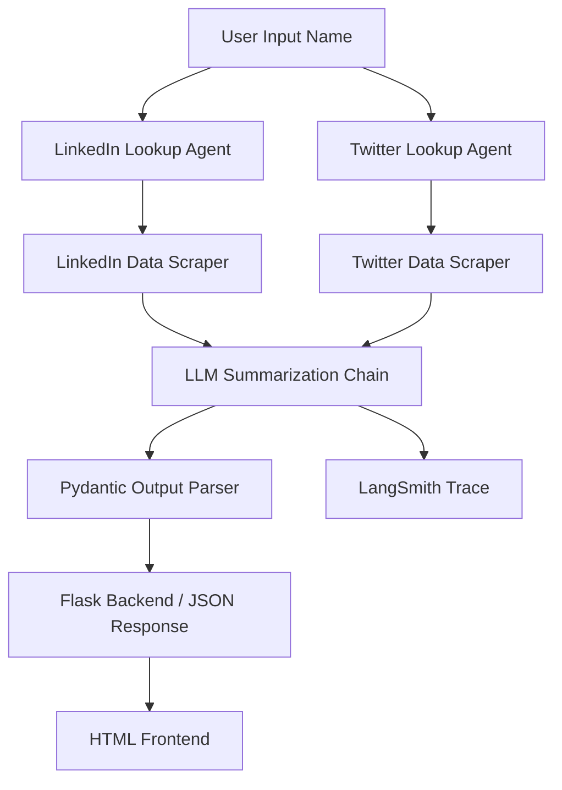
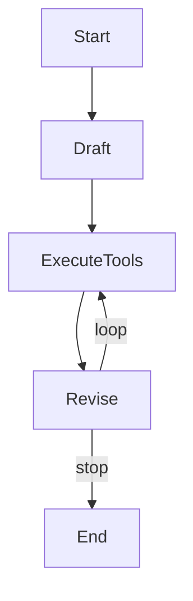

prompt: 下面是字幕，如何建立agent。根据字幕，给我步骤。 我会一直提供字幕，直到我通知你生成答案。不要给我生成答案，在我通知你之前。
prompt: 根据我提供的所有字幕，系统地总结出 **从零构建 Reflexion Agent 的完整步骤**，分为阶段、子任务与关键实现细节。
prompt: 按照要求**“Reflection Agent 答案结构”** 格式整理的系统总结—— 完整复盘prompt engineer theory的全流程，包括阶段、子任务、关键实现细节与每阶段产物。

# Section 9: prompt engineering theory
格式遵循你要求的 **「Reflection Agent 答案结构」** ——系统化分阶段、子任务化梳理、含关键实现细节与阶段产物。

---

# 🧠 Prompt Engineering & Context Engineering 全流程系统复盘

> **From Theory → Implementation → Agent Integration**

---

## 🩵 Phase 1：语言模型基础理解（Language Modeling Foundation）

### 🎯 目标

建立对语言模型（LM & LLM）的概率论本质、推理机制与局限的理解，为后续 Prompt 与 Agent 构建打地基。

### 🧩 子任务

1. **理解语言建模定义**

   * LM = 对一系列词的联合概率分布建模。
   * 数学形式：P(Xₜ₊₁ | X₁, X₂, …, Xₜ)
   * 实际含义：预测下一个最可能的词（智能补全）。

2. **从 LM → LLM 的扩展**

   * LLM 是在大规模语料上训练的 LM（通常 >100B 参数）。
   * 能处理跨任务、多语言、多模态的上下文概率建模。

3. **核心局限**

   * 本质是“概率猜测”而非事实推理。
   * 可能产生幻觉（Hallucination）。

### 🧰 实现关键点

* 语言模型仅通过上下文概率推断生成内容。
* 输出稳定性完全取决于输入语境质量。

### 🧾 阶段产物

* 对「LLM 输出 = 概率最大词序列」的认知。
* Prompt 工程的基础假设：**“输出质量取决于输入结构。”**

---

## 🩵 Phase 2：Prompt 组成结构与语义控制

### 🎯 目标

理解 Prompt 的核心组件与功能作用，为后续工程化 Prompt 设计提供可拆解模板。

### 🧩 子任务

1. **Prompt 四大组件定义**

   | 组件                     | 功能         | 示例                                |
   | ---------------------- | ---------- | --------------------------------- |
   | Instruction（任务指令）      | 告诉模型要做什么   | “Summarize the text below.”       |
   | Context（上下文信息）         | 提供背景知识     | “Given a product review dataset…” |
   | Input Data（输入数据）       | 模型要处理的具体数据 | “Review: ‘The screen is dim…’”    |
   | Output Indicator（输出标识） | 告诉模型输出期望   | “Answer:” 或 “Output JSON:”        |

2. **组件协同原则**

   * 清晰任务 + 明确边界 + 明示输出形式。

### 🧰 实现关键点

* Prompt = Structured Query。
* 每个部分可独立调优（指令、上下文、示例、格式）。

### 🧾 阶段产物

* Prompt Schema（结构模板）。
* Prompt Diagnosis Checklist（指令清晰度、上下文完整性、输入精度、输出一致性）。

---

## 🩵 Phase 3：Prompt 类型与推理技巧（Zero / One / Few / CoT / ReAct）

### 🎯 目标

掌握不同推理复杂度下的 Prompt 设计策略，理解它们在 LLM 逻辑推理与任务泛化中的作用。

---

### 🧩 子任务 1：Zero-Shot Prompting

**定义：** 直接给出任务，无示例。
**优点：** 快速；**缺点：** 输出不稳定、可解释性差。
**典型应用：** “List top 10 travel destinations.”

---

### 🧩 子任务 2：One-Shot & Few-Shot Prompting

**定义：** 提供 1 或少量示例以建立模式。
**机制：** 示例即 “微型训练样本”。
**作用：** 提高风格一致性与格式遵循性。

| 模式       | 示例数 | 优势        | 劣势        |
| -------- | --- | --------- | --------- |
| One-Shot | 1   | 引导单任务模仿   | 仍偏脆弱      |
| Few-Shot | >1  | 稳定输出、可控风格 | Token 成本高 |

---

### 🧩 子任务 3：Chain of Thought (CoT)

**目标：** 将多步推理任务拆解为中间步骤。
**实现：** 在 Prompt 中显式添加 “Let’s think step by step.”
**效果：** 显著提升逻辑与数学推理准确率。
**分类：**

* **Zero-Shot CoT**：模型自生思考路径。
* **Few-Shot CoT**：提供示例推理链指导模型。

---

### 🧩 子任务 4：ReAct（Reason + Act）

**核心思想：** 结合“思考链”与“工具调用”。
**机制：**

* 模型先生成 Thought（推理意图）。
* 再生成 Action（调用外部工具，如 Search）。
* 获得 Observation（外部信息反馈）。
* 重复 Reason→Act→Observe 循环直至完成任务。

**意义：**

* 模拟人类推理与行动闭环。
* 是现代 **Agent Framework（如 LangChain）** 的理论基础。

---

### 🧾 阶段产物

* Prompt 类型选择矩阵（Zero / One / Few / CoT / ReAct）。
* 模板化 Prompt 模式库。

---

## 🩵 Phase 4：Prompt Engineering 原则与最佳实践

### 🎯 目标

掌握可迁移的 Prompt 优化技巧，实现可控、高一致性输出。

### 🧩 子任务

1. **添加上下文（Context Relevance）**

   * 为任务提供精确背景。
   * 避免模型自行假设上下文（防止偏题）。

2. **任务清晰（Clarity of Task）**

   * 明确目标与成功指标。
   * 避免模糊指令如 “Improve the UX”。
   * 优化为 “Identify and resolve UX pain points to increase conversion.”

3. **具体化（Specificity）**

   * 明确范围、指标、边界。

4. **迭代（Iteration）**

   * 类似软件工程的 “Build → Measure → Learn” 循环。
   * 每次输出 → 分析 → 调整 → 精炼 → 稳定化。

### 🧰 实现关键点

* Prompt 是“实验产物”，非固定模板。
* 迭代 Prompt = 迭代思维。

### 🧾 阶段产物

* Prompt Refinement Log（优化记录）。
* Iterative Improvement Framework（循环微调机制）。

---

## 🩵 Phase 5：Context Engineering（上下文工程）

### 🎯 目标

从静态 Prompt 过渡到动态上下文管理系统，为 Agent 级任务构建可控信息环境。

### 🧩 子任务

1. **概念定义**

   * Context Engineering = 动态管理传入 LLM 的上下文（信息、工具、历史）。
   * Prompt 是静态文本；Context 是可演化状态。

2. **上下文来源**

   * 用户输入
   * 历史对话记忆
   * 工具调用结果
   * 系统设定（System Prompts）
   * 外部数据（API / DB / 文件）

3. **常见问题与风险**

   | 问题                | 含义          | 后果      |
   | ----------------- | ----------- | ------- |
   | Context Poisoning | 错误或幻觉污染后续逻辑 | 输出偏离事实  |
   | Context Confusion | 无关上下文干扰     | 响应不集中   |
   | Context Clash     | 上下文矛盾       | 推理紊乱或冻结 |

4. **Context 工程策略**

   * 相关性过滤（Relevance Filtering）
   * 窗口滑动（Sliding Window）
   * 检索增强（RAG / Vector Store）
   * 动态记忆更新（Stateful Memory）

### 🧾 阶段产物

* Context Flow Graph（上下文流转图）
* Context Optimization Checklist（上下文质量控制表）

---

## 🩵 Phase 6：System Prompts 与上下文治理机制

### 🎯 目标

理解系统提示的工程地位与设计平衡，实现稳定、一致且可扩展的 Agent 行为。

### 🧩 子任务

1. **System Prompt 的地位**

   * 是 LLM 行为的“宪法” (Constitution)。
   * 决定 Agent 的角色、边界与推理框架。
   * 长达 200–400 行，是 AI 产品的核心资产。

2. **常见失衡现象**

   | 类型                    | 特征            | 缺陷     |
   | --------------------- | ------------- | ------ |
   | 过度具体 (Too Specific)   | 硬编码逻辑、流程式控制   | 僵化、难扩展 |
   | 过度模糊 (Too Vague)      | 无边界指令、语义模糊    | 输出不一致  |
   | 平衡型 (Goldilocks Zone) | 框架式指导 + 启发式原则 | 稳定且泛化  |

3. **良好 System Prompt 的结构层次**

   * ① 明确身份与范围（Identity & Scope）
   * ② 任务目标与推理框架（Goal & Reasoning Framework）
   * ③ 启发式原则（Heuristics）
   * ④ 限制与边界（Boundaries）

4. **工程原则**

   * 以原则指导而非命令约束。
   * 减少重复与冲突指令。
   * 通过多轮迭代维护稳定性。

### 🧾 阶段产物

* System Prompt Template（系统提示框架）
* “Goldilocks Zone” 平衡指南
* Prompt Governance Guideline（提示治理规范）

---

## 🩵 Phase 7：集成与产物形成（From Prompt to Agent）

### 🎯 目标

将所有 Prompt 理论落地到实际工程体系中，如 LangChain Agent、Context Graph、System Prompt、Tool Node。

### 🧩 子任务

1. **Prompt → Chain → Agent 转换**

   * Prompt：定义任务逻辑。
   * Chain：封装输入输出与依赖。
   * Agent：加入动态推理与工具调用。

2. **Agent 架构组件**

   * LLM（Reasoning Engine）
   * Tools（外部行动能力）
   * Memory（上下文存储）
   * State Graph（控制逻辑）
   * Observability（如 LangSmith 追踪系统）

3. **全栈示例：IceBreaker Agent**

   * 集成 LinkedIn/Twitter 搜索 Agent、LLM Summarization、Pydantic Output Parser、Flask Web UI。
   * Context + Tool + Prompt + OutputParser → 完整闭环。

### 🧾 阶段产物

* 可执行 Agent 架构图
* LangChain Pipeline 模板
* LangSmith Observability 配置

---

## 🧩 最终总结（Meta Reflection）

| 维度       | 从 Prompt → Agent 的进化                                   |
| -------- | ------------------------------------------------------ |
| **范式**   | 静态指令 → 动态上下文 → 自主决策                                    |
| **核心目标** | 提供清晰输入、稳定输出、可控推理链                                      |
| **工程焦点** | Prompt 清晰度 → Context 相关性 → System Prompt 平衡            |
| **产物体系** | Prompt 模板库、Context 管理器、System Prompt 宪法、Agent Graph 流程 |
| **方法论**  | 迭代 + 框架化 + 可观测性（LangSmith）                             |

---

✅ **最终结论**

> Prompt Engineering 是语言层的控制艺术，
> Context Engineering 是信息流的治理科学，
> System Prompt 是 Agent 行为的宪法，
> 而三者结合，构成了现代 Agentic AI 的工程基石。


# Section 11: Icebreaker Agent
以下是按照你要求的 **“Reflection Agent 答案结构”** 格式整理的系统总结——
完整复盘《从零构建 Icebreaker Agent》的全流程，包括阶段、子任务、关键实现细节与每阶段产物。
该结构遵循 “阶段 ➜ 子任务 ➜ 实现细节 ➜ 产出/目标” 四层组织逻辑，确保可操作性与可复现性。

---

# 🧭 从零构建 Icebreaker Agent —— 系统步骤全景图

---

## 🩵 **Phase 1 — Conceptual Foundation: Understanding Agentic Design**

### 🎯 **Goal:**

掌握 “Agentic 应用” 的原理 —— 让 LLM 不仅能回答，还能**推理 + 行动 + 调用外部工具**。

### 🧩 **Subtasks:**

1. **Define the problem**

   * LLM 无法直接访问实时信息（如天气、价格、数据库）。
   * 我们需要一个“可行动”的系统 —— 由 LLM + 工具组成的 Agent。

2. **Understand ReAct Architecture**

   * **Reason**：模型推理应执行何步骤。
   * **Act**：调用外部工具（如搜索、API）。
   * **Loop**：根据结果继续推理 → 决定是否继续行动。

3. **Core abstractions in LangChain**

   | 概念                | 功能                 | 备注                               |
   | ----------------- | ------------------ | -------------------------------- |
   | **LLM**           | 推理引擎               | 负责思考和指令生成                        |
   | **Tool**          | 可调用的外部函数           | 封装 API / 数据源                     |
   | **Agent**         | 管理 Reason + Act 流程 | 可选择不同算法（ReAct、Plan-and-Execute等） |
   | **AgentExecutor** | 执行循环与日志管理          | 实际运行引擎                           |

### ⚙️ **Implementation Detail**

* 选用 **LangChain + GPT-4 mini** 为核心框架。
* ReAct 是最经典 Agent 算法。

### ✅ **Output of this phase:**

具备清晰的 mental model：

> “LLM 负责思考，Tool 负责行动，Agent 协调两者完成任务。”

---

## 🩵 **Phase 2 — Build the Core: LinkedIn Lookup Agent**

### 🎯 **Goal:**

构建一个 Agent，可通过姓名自动检索 LinkedIn 个人档案 URL。

### 🧩 **Subtasks:**

#### 1️⃣ Environment Setup

* 创建 `.env` 存储 API Keys。
* 使用 `dotenv` 加载环境变量。
* 依赖：`langchain`, `openai`, `tavily`, `python-dotenv`.

#### 2️⃣ Initialize LLM

```python
llm = ChatOpenAI(model="gpt-4-mini", temperature=0)
```

#### 3️⃣ Define Prompt Template

```python
template = """
Given the full name {name_of_person},
find their LinkedIn profile URL.
Your answer should contain only the URL.
"""
prompt = PromptTemplate(
    input_variables=["name_of_person"],
    template=template
)
```

#### 4️⃣ Build Search Tool (via Tavily API)

```python
def get_profile_url(name: str):
    search = TavilySearchResults()
    return search.run(f"{name} LinkedIn profile")
```

封装成 LangChain Tool：

```python
tools = [
  Tool(
    name="Crawl Google for LinkedIn profile page",
    func=get_profile_url,
    description="Useful for finding LinkedIn profiles."
  )
]
```

#### 5️⃣ Create ReAct Agent

```python
react_prompt = hub.pull("hwchase17/react")
agent = create_react_agent(llm, tools, react_prompt)
agent_executor = AgentExecutor(agent=agent, tools=tools, verbose=True)
```

#### 6️⃣ Test Run

```python
result = agent_executor.invoke({"input": "Find LinkedIn of Eden Marco"})
```

### ✅ **Output:**

可执行的 LinkedIn 搜索 Agent，返回目标 URL。

---

## 🩵 **Phase 3 — Extend Capability: Twitter Agent & Data Scraper**

### 🎯 **Goal:**

扩展 Agent 的信息源 —— 加入 Twitter 搜索与推文抓取。

### 🧩 **Subtasks:**

#### 1️⃣ Create `tools/twitter.py`

使用 Tweepy 或 Mock JSON：

```python
def scrape_user_tweets(username, n=5, mock=True):
    if mock:
        return requests.get(GIST_URL).json()
    else:
        client = tweepy.Client(bearer_token=TOKEN)
        tweets = client.get_users_tweets(id, max_results=n)
        return [tweet.text for tweet in tweets.data]
```

#### 2️⃣ Build Twitter Lookup Agent

* 复制 LinkedIn Agent 逻辑。
* 修改 prompt：

  ```
  Given the name {name_of_person}, find their Twitter profile URL and extract the username.
  ```
* 修改工具描述：

  ```
  "Crawl Google for Twitter profile page"
  ```

#### 3️⃣ Integrate into Icebreaker Pipeline

```python
linkedin_url = linkedin_lookup_agent(name)
twitter_username = twitter_lookup_agent(name)
tweets = scrape_user_tweets(twitter_username)
```

### ✅ **Output:**

Agent 具备多源信息检索能力：LinkedIn + Twitter。

---

## 🩵 **Phase 4 — Intelligence Layer: LLM Chain Summarization**

### 🎯 **Goal:**

融合多源信息，生成简短介绍与有趣事实。

### 🧩 **Subtasks:**

#### 1️⃣ Build Summary Prompt

```python
summary_template = """
Given the information from LinkedIn ({linkedin_data})
and recent Twitter posts ({twitter_posts}),
create a short summary and two interesting facts.
"""
```

#### 2️⃣ Chain Composition

```python
chain = summary_template | llm
result = chain.invoke({
    "linkedin_data": linkedin_profile,
    "twitter_posts": tweets
})
```

#### 3️⃣ Add Mock Option

* 可通过 `mock=True` 跳过真实 API 调用以节约 Token。

### ✅ **Output:**

LLM 生成完整人设摘要 + 趣闻。

---

## 🩵 **Phase 5 — Structure the Output: Pydantic Output Parser**

### 🎯 **Goal:**

让 LLM 输出可被代码直接使用的结构化数据。

### 🧩 **Subtasks:**

#### 1️⃣ Define Schema

```python
class Summary(BaseModel):
    summary: str
    facts: List[str]
```

#### 2️⃣ Define Parser

```python
summary_parser = PydanticOutputParser(pydantic_object=Summary)
```

#### 3️⃣ Inject Format Instructions

```python
prompt = PromptTemplate(
  template=summary_template + "\n{format_instructions}",
  input_variables=["linkedin_data", "twitter_posts"],
  partial_variables={
      "format_instructions": summary_parser.get_format_instructions()
  }
)
```

#### 4️⃣ LangChain Expression Language (LCE)

```python
chain = prompt | llm | summary_parser
res = chain.invoke(inputs)
```

#### ✅ **Output:**

```json
{
  "summary": "Eden Marco is a software engineer...",
  "facts": ["Posts about LangChain", "Shares AI tutorials"]
}
```

---

## 🩵 **Phase 6 — Product Integration: Flask Web Application**

### 🎯 **Goal:**

构建前后端一体的可交互应用。

### 🧩 **Subtasks:**

#### 1️⃣ Flask Backend

```python
app = Flask(__name__)

@app.route("/")
def index():
    return render_template("index.html")

@app.route("/process", methods=["POST"])
def process():
    name = request.form["name"]
    summary, pic = icebreaker(name)
    return jsonify({"summary": summary.to_dict(), "profile_pic": pic})
```

#### 2️⃣ HTML Frontend

`templates/index.html`

```html
<form id="icebreaker-form">
  <input type="text" name="name" placeholder="Enter a name">
  <button type="submit">Generate</button>
</form>
<div id="result"></div>
```

#### 3️⃣ Data Flow

用户输入 → Flask 调用 Agent → LLM → 返回 JSON → 前端渲染。

### ✅ **Output:**

运行于 `localhost:5000` 的交互式 AI Icebreaker。

---

## 🩵 **Phase 7 — Observability: LangSmith Integration**

### 🎯 **Goal:**

实现端到端可观测性与调试。

### 🧩 **Subtasks:**

#### 1️⃣ Environment Variables

```bash
LANGCHAIN_API_KEY=sk-xxx
LANGCHAIN_TRACING_V2=true
LANGCHAIN_PROJECT="Ice Breaker"
```

#### 2️⃣ Enable Tracing

LangSmith 自动捕获：

* 每次 Prompt、Tool 调用；
* Reasoning steps；
* Token 消耗、延迟；
* 每个 LLM 调用结果。

#### 3️⃣ Use Cases

* 生产环境问题定位；
* 性能优化；
* 成本分析；
* traceID 搜索。

### ✅ **Output:**

在 LangSmith 控制台中可视化完整 Agent 执行路径。

---

## 🩵 **Phase 8 — Beyond MVP: Commercialization & Inspiration**

### 🎯 **Goal:**

展示从教学 Demo 到 SaaS 产品的可行路径。

### 💼 **Examples:**

| 产品                   | 功能                      | 价值延伸      |
| -------------------- | ----------------------- | --------- |
| **Hoppy Copy**       | 输入 LinkedIn / 网站生成个性化邮件 | 完整 SaaS 化 |
| **AiSDR**            | 与 HubSpot 集成的自动化邮件生成    | B2B 销售自动化 |
| **Chrome Extension** | Hover LinkedIn 即生成破冰语   | 工具级轻量化落地  |

### 🪄 **Key Takeaways**

* 可扩展维度：

  * 增加 CRM 集成（Salesforce、HubSpot）；
  * 增强 Prompt 个性化；
  * 使用向量数据库做用户记忆；
  * 加入团队协作与订阅系统；
* Icebreaker 是企业级 Agent 的最小原型（MVP）。

---

# 🧩 **Final Architecture Overview**



---

# ✅ **Outcome Summary**

| 阶段      | 产出                    | 关键组件                          |
| ------- | --------------------- | ----------------------------- |
| Phase 1 | Agent 概念与架构           | ReAct, Tool, AgentExecutor    |
| Phase 2 | LinkedIn Lookup Agent | Tavily + GPT                  |
| Phase 3 | Twitter Agent & 数据抓取  | Tweepy + Mock 数据              |
| Phase 4 | Summarization Chain   | PromptTemplate + LLM          |
| Phase 5 | 结构化输出                 | PydanticOutputParser          |
| Phase 6 | 全栈集成                  | Flask + HTML                  |
| Phase 7 | 可观测性                  | LangSmith                     |
| Phase 8 | 产品化启发                 | HoppyCopy / AiSDR / Chrome 扩展 |

---

👉 **一句话总结：**

> Icebreaker Agent 是一个典型的 **Agentic Full-Stack GenAI 应用** ——
> 以 LangChain ReAct 为核心，融合外部数据源（LinkedIn、Twitter），
> 通过结构化输出与前端展示，实现了从推理、执行到生产级可观测性的完整闭环。


# Section 13: langGraph 
你现在提供的所有字幕完整覆盖了从 **LangChain → LangGraph → Flow Engineering → ReAct Agent 实现** 的全过程。
下面是一个系统化总结，整理成「**阶段 → 子任务 → 实现要点**」的形式，帮助你从零构建一个 **LangGraph-based Agentic RAG / ReAct Agent**。

---

## 🧩 总体概览：从零构建 Agent 的五个阶段

| 阶段       | 目标                                               | 产出                                 |
| -------- | ------------------------------------------------ | ---------------------------------- |
| **阶段 1** | 理解概念与框架：LangChain → LangGraph → Flow Engineering | 明确为什么要用图结构表达 agent 逻辑              |
| **阶段 2** | 设计系统结构：State + Nodes + Edges                     | 定义 agent 的状态机与控制流                  |
| **阶段 3** | 构建推理与工具层（Reasoning + Tools）                      | 实现带 Function Calling 的 LLM 推理引擎    |
| **阶段 4** | 构建执行图（Graph Assembly）                            | 使用 LangGraph 连接节点与条件边形成完整 flow     |
| **阶段 5** | 执行与调试                                            | 调用 graph、验证推理循环、查看 LangSmith trace |

---

## 🧱 阶段 1：理解概念与框架

### 子任务 1.1：LangChain 的局限

* LangChain 擅长构建 **线性链式应用**（chains、routers），但不支持循环。
* 无法表达复杂 agent 流程（例如「Reason → Tool → Reason → End」的循环）。

### 子任务 1.2：LangGraph 的定位

* LangGraph 允许将整个 agent 表达为 **图（graph）或状态机（state machine）**。
* 特点：

  * 支持 **循环（cycles）**；
  * 支持 **条件分支（conditional edges）**；
  * 支持 **状态持久化（state persistence）**；
  * 内建与 **LangSmith** 的追踪集成；
  * 特化为构建 **agentic 应用**。

### 子任务 1.3：Flow Engineering 思想

* “**我们定义流程，LLM 决定路径。**”
* 开发者负责设计：

  * 状态（state）；
  * 流程节点（nodes）；
  * 控制条件（edges）。
* LLM 在流程中参与两类决策：

  1. 在节点内部执行（生成文本、调用工具）；
  2. 在节点间路由（选择下一步）。

---

## ⚙️ 阶段 2：设计系统结构（Graph Core）

### 子任务 2.1：核心组件

| 组件                   | 说明                                             |
| -------------------- | ---------------------------------------------- |
| **Node**             | Python 函数，执行具体逻辑（可是 deterministic 代码或 LLM 调用）。 |
| **Edge**             | 连接节点的普通边，定义固定执行顺序。                             |
| **Conditional Edge** | 决策性边，基于状态决定下一个节点。                              |
| **State**            | 字典对象（`TypedDict`），保存上下文、结果与中间状态。               |

### 子任务 2.2：State 定义（state.py）

```python
from typing import TypedDict, List

class GraphState(TypedDict):
    question: str
    generation: str
    web_search: bool
    documents: List[str]
```

* 存储 agent 的运行上下文；
* 每个节点接收 state、返回一个部分更新的字典。

---

## 🧠 阶段 3：构建推理与工具层（Reasoning & Tools）

### 子任务 3.1：定义工具（react.py）

* 示例工具：

  * **Triple Tool**：输入数字 → 输出三倍；
  * **Search Tool**（如 Tavily）：进行 Web 搜索。

```python
@tool
def triple(num: float) -> float:
    """Triples the given number."""
    return num * 3

tools = [TavilySearch(max_results=1), triple]
```

### 子任务 3.2：绑定工具到 LLM

```python
llm = ChatOpenAI(model="gpt-4-turbo")
llm_with_tools = llm.bind_tools(tools)
```

* 使用 **Function Calling**，LLM 可以自动选择并返回需要调用的工具及参数；
* 无需手写 React Prompt，解析逻辑由模型供应商负责。

---

## 🧩 阶段 4：构建执行图（Graph Assembly）

### 子任务 4.1：实现节点逻辑（nodes.py）

#### ① 推理节点（Reason Node）

* 输入：state（包含所有历史 messages）
* 输出：更新后的 messages（追加 AI 回复）

```python
def agent_reason(state: MessagesState):
    response = llm_with_tools.invoke(state["messages"])
    return {"messages": state["messages"] + [response]}
```

#### ② 工具执行节点（Tool Node）

* 使用 `ToolNode`（LangGraph prebuilt）

```python
tool_node = ToolNode(tools=tools)
```

* 自动检测上一步是否包含函数调用；
* 自动执行并返回结果。

---

### 子任务 4.2：拼接节点成图（main.py）

```python
flow = StateGraph(MessagesState)
flow.add_node("agent_reason", agent_reason)
flow.add_node("act", tool_node)
flow.set_entry_point("agent_reason")
```

### 子任务 4.3：定义条件边逻辑

```python
def should_continue(state: MessagesState) -> str:
    last_msg = state["messages"][-1]
    return "act" if last_msg.get("tool_calls") else "end"

flow.add_conditional_edges(
    "agent_reason",
    should_continue,
    {"act": "act", "end": "end"}
)
flow.add_edge("act", "agent_reason")
```

* **逻辑：**

  * 如果 LLM 决定调用工具 → 进入 “act”；
  * 否则 → 结束；
  * 工具执行完 → 返回 Reasoning 再次判断。

---

## 🚀 阶段 5：执行与调试

### 子任务 5.1：执行 Agent

```python
result = flow.invoke({
    "messages": [HumanMessage(content="What is the weather in Tokyo? List it and then triple it.")]
})
print(result["messages"][-1].content)
```

### 子任务 5.2：观察输出

```
The current temperature in Tokyo is 15°C. Tripled gives 45°C.
```

### 子任务 5.3：追踪与优化

* 使用 **LangSmith** 查看执行 trace：

  * 每个 node 的输入输出；
  * LLM 决策的函数调用；
  * 工具执行结果。
* 调优策略：

  1. 增加 `max_results` 改进搜索；
  2. 控制循环上限；
  3. 在 `should_continue` 中添加终止条件。

---

## 🧩 可扩展方向

| 能力                    | 实现方式                                                  |
| --------------------- | ----------------------------------------------------- |
| **RAG 增强**            | 在 reasoning node 前添加检索节点（Retriever Node）              |
| **自反思 (Self-RAG)**    | 添加 grader 节点（Hallucination / Answer Grader）           |
| **Adaptive Routing**  | 添加 router chain → 条件入口点 (set_conditional_entry_point) |
| **人类反馈 (HITL)**       | 在 Conditional Edge 中加入人工确认逻辑                          |
| **持久化 (Persistence)** | 使用内建 state 存储，支持恢复或时间旅行                               |

---

## 🧭 总结流程（简化版）

```
阶段 1：理解框架与动机
阶段 2：定义 State (GraphState)
阶段 3：实现 Tools + Function Calling LLM
阶段 4：实现 Nodes (Reason, Tool) + Graph (Edges, Condition)
阶段 5：执行 + 调试 + 优化
```

---


# Section 14: Reflection Agent
非常好，这段字幕是讲 **如何用 LangGraph 建立一个完整的 AI Agent（基于 Flow Engineering 思想）**。
下面我将把整段内容拆解成 **逐步构建流程**，并解释每一步的 **目的、关键点、和代码逻辑**。

---

## 🧭 一、总体目标

要构建一个具备「**生成（Generate）→ 反思（Reflect）→ 再生成**」循环逻辑的 Agent。

LangGraph 用「**节点（Nodes）+ 边（Edges）+ 状态（State）**」描述整个流程。
目标是构建一个工作流（Workflow），让 LLM 在既定流程中循环生成与改进输出。

---

## 🧩 二、构建步骤总览（宏观流程）

| 阶段     | 主要工作                     | 结果             |
| ------ | ------------------------ | -------------- |
| Step 1 | 定义 Chains（生成链、反思链）       | Agent 的基本逻辑块   |
| Step 2 | 定义 Nodes（节点）             | 每个节点执行一个 chain |
| Step 3 | 定义 State（状态结构）           | 保存上下文消息历史      |
| Step 4 | 构建 Graph（图结构）            | 把节点、边、条件逻辑连起来  |
| Step 5 | 定义条件函数 `should_continue` | 决定继续循环还是结束     |
| Step 6 | 编译、绘制并测试 Graph           | 输出可视化并验证流程     |

---

## 🧱 Step 1：定义 Chains（已在前一节完成）

* **Generate Chain**：生成推文（AI 输出）
* **Reflect Chain**：对生成结果进行反思、批评
* 每个 Chain 之后都会返回一个 **消息对象（BaseMessage / AIMessage）**

---

## 🧠 Step 2：定义 Nodes（节点）

每个节点对应一个 chain：

| 节点           | 调用的 Chain        | 输入                    | 输出                | 功能     |
| ------------ | ---------------- | --------------------- | ----------------- | ------ |
| **generate** | `generate_chain` | 当前状态（message history） | AI 生成的新消息         | 执行生成逻辑 |
| **reflect**  | `reflect_chain`  | 当前状态                  | 人类消息（模拟 critique） | 执行反思逻辑 |

> 生成节点的输出是 `AIMessage`，反思节点的输出是 `HumanMessage`（这是一个 prompt engineering 技巧，让模型认为批评来自人类，从而提升响应质量）。

---

## 📦 Step 3：定义 State（状态结构）

状态用于保存所有消息的上下文。
使用 `TypedDict` 声明结构化数据：

```python
class MessageGraph(TypedDict):
    messages: Annotated[List[BaseMessage], add_messages]
```

* `messages`：保存所有的历史消息（人类与 AI）；
* `add_messages`：一个 **reducer 函数**，定义如何更新状态；

  * 每次节点执行后新消息会被「append」到历史列表，而不是覆盖；
  * 这保证了对话上下文持续积累。

---

## 🧩 Step 4：创建 Graph 并添加 Nodes

创建一个 `StateGraph` 对象：

```python
workflow = StateGraph(state_schema=MessageGraph)
```

添加节点：

```python
workflow.add_node("generate", generation_node)
workflow.add_node("reflect", reflection_node)
```

设置 **入口节点（entry point）**：

```python
workflow.set_entry_point("generate")
```

> 这会在内置的 `Start` 节点与 `generate` 节点之间自动创建一条初始边。

---

## 🔀 Step 5：定义 Edges（边与条件逻辑）

### (1) 固定边（Deterministic Edge）

* `reflect → generate`：每次反思后必定进入新的生成。

### (2) 条件边（Conditional Edge）

* `generate → reflect` 或 `generate → end`：由条件函数 `should_continue` 决定。

```python
def should_continue(state: MessageGraph) -> str:
    if len(state["messages"]) >= 6:
        return "end"
    else:
        return "reflect"
```

然后在图中添加这条条件边：

```python
workflow.add_conditional_edges(
    "generate",                     # 来源节点
    should_continue,                # 条件函数
    path_map={"reflect": "reflect", "end": END}  # 目标映射
)
```

---

## 🪄 Step 6：编译与可视化

```python
graph = workflow.compile()
```

可使用以下方式导出可视化结构：

* Mermaid 图（适合导入 Excalidraw 或 Markdown）：

  ```python
  print(graph.get_graph().draw_mermaid())
  ```
* ASCII 图（命令行查看）：

  ```python
  graph.get_graph().print_ascii()
  ```

Mermaid 图例：

```
Start --> Generate
Generate --> Reflect
Reflect --> Generate
Generate --> End
```

---

## 🔁 Step 7：运行时执行逻辑

执行顺序如下：

1. **Generate Node** → 运行 `generate_chain`
2. 调用 `should_continue` 判断：

   * 若条件满足 → 跳至 **Reflect Node**
   * 若结束 → 跳至 **End Node**
3. **Reflect Node** → 运行 `reflect_chain`
4. 更新状态 → 再次回到 Generate Node
5. 重复循环直到 `should_continue` 返回 "end"

---

## ⚙️ Step 8：运行后的结果

运行时：

* 所有消息依次追加到 `state["messages"]`
* 模型每次调用都能看到完整历史上下文
* 可在 trace 中观察每次生成与反思的演进

---

## 💡 关键总结

| 模块                | 核心作用      | LangGraph 对应                             |
| ----------------- | --------- | ---------------------------------------- |
| **State**         | 保存所有上下文   | `TypedDict` + Reducer                    |
| **Node**          | 执行具体逻辑    | Chain 调用函数                               |
| **Edge**          | 定义执行路径    | `add_edge()` / `add_conditional_edges()` |
| **Reducer**       | 定义状态更新方式  | `add_messages`                           |
| **Flow Control**  | 控制何时继续/结束 | `should_continue()`                      |
| **Visualization** | 输出流程图     | `draw_mermaid()` / `print_ascii()`       |

---
# Section 15 Reflexion Agent

非常好！你已经完整提供了建立 **Reflexion Agent（反思型智能体）** 的全部教学字幕内容。
下面我将根据你提供的所有字幕，系统地总结出 **从零构建 Reflexion Agent 的完整步骤**，分为阶段、子任务与关键实现细节。
（这对应 LangGraph + LangChain 实现的「具备自我反思、搜索与修订能力」的 Agent 架构）

---

# 🧭 一、总体目标

构建一个具备以下特性的 **Reflection Agent**：

* 能生成高质量的文章回答；
* 会对自己的输出进行批评（critique）；
* 可使用搜索工具实时查找外部信息；
* 在多轮循环中修订答案、添加引用；
* 最终输出包含内容、批评、引用的结构化结果。

---

# 🧩 二、系统组件结构概览

| 模块                                      | 主要功能                                        |
| --------------------------------------- | ------------------------------------------- |
| **First Responder Chain (Actor Agent)** | 生成初稿 + 批评 + 搜索建议                            |
| **Tool Executor Node**                  | 根据搜索建议调用 Tavily API 获取实时数据                  |
| **Reviser Chain (Reviser Agent)**       | 使用搜索结果与批评修订文章并添加引用                          |
| **State (MessageGraph)**                | 储存所有消息与执行上下文                                |
| **Graph (LangGraph)**                   | 定义节点连接与循环逻辑（Draft → Search → Revise → Loop） |

---

# 🧱 三、详细构建步骤

## Step 1️⃣ 设计总体架构

1. 定义 3 个节点：

   * **Draft Node** → 生成初稿；
   * **Execute Tools Node** → 调用 Tavily 搜索；
   * **Revise Node** → 使用搜索结果修订答案。
2. 设置执行顺序：

   ```
   Start → Draft → Execute Tools → Revise → (loop or end)
   ```
3. 使用 **LangGraph** 构建有状态的 Graph。

---

## Step 2️⃣ 构建 State（消息状态）

```python
from typing import List
from langchain.schema import BaseMessage
from langgraph.graph import add_messages
from typing_extensions import TypedDict, Annotated

class MessageGraph(TypedDict):
    messages: Annotated[List[BaseMessage], add_messages]
```

* `messages` 保存所有人类、AI 与工具调用消息；
* `add_messages` 是 reducer，确保状态更新为“追加”，而非覆盖。

---

## Step 3️⃣ 构建 Actor Agent（First Responder Chain）

### ✳️ 功能

根据主题生成：

* 初稿（article content）
* 批评（critique）
* 搜索建议（search queries）

### ✳️ 关键步骤

1. **导入模块**（包括 `ChatOpenAI`, `ChatPromptTemplate`, `Pydantic` 等）；
2. **创建 Prompt 模板**：

```python
actor_prompt_template = ChatPromptTemplate.from_messages([
    ("system", 
     "You are an expert researcher. Current time: {time}. "
     "1️⃣ Write a 250-word article.\n"
     "2️⃣ Reflect and critique your answer (be severe).\n"
     "3️⃣ Recommend search queries to improve your answer.")
])
```

3. **定义输出 Schema（schemas.py）**：

```python
from pydantic import BaseModel, Field
from typing import List

class Reflection(BaseModel):
    missing: str = Field(..., description="Important info missing")
    superfluous: str = Field(..., description="Unnecessary info")

class AnswerQuestion(BaseModel):
    answer: str = Field(..., description="250-word essay")
    reflection: Reflection
    search_queries: List[str] = Field(..., description="1–3 search terms")
```

4. **创建 LLM 与解析器**：

   * 使用 `GPT-4 Turbo`
   * 使用 `PydanticToolsOutputParser` 和 `JSONOutputToolsParser`
   * 通过 function calling 绑定输出结构：

```python
chain = (
    actor_prompt_template
    | llm.bind_tools(tools=[AnswerQuestion], tool_choice="AnswerQuestion")
    | PydanticToolsOutputParser(pydantic_object=AnswerQuestion)
)
```

5. **运行测试**：

   * 输入一个主题（例如 `"AI-powered SOC startups"`）
   * 输出结构中包含 `answer`, `reflection`, `search_queries`

---

## Step 4️⃣ 构建 Reviser Agent（Revision Chain）

### ✳️ 功能

利用前一步生成的批评与搜索结果，修订文章，添加引用。

### ✳️ 步骤

1. **在 `schemas.py` 新增类**：

```python
class ReviseAnswer(AnswerQuestion):
    references: List[str] = Field(..., description="URLs for citations")
```

2. **定义新的指令模板**：

```python
revise_instructions = """
Revise your previous answer using the critique and new info.
- Add missing info and remove superfluous details.
- Add numerical citations.
- Include a References section (URLs).
"""
```

3. **复用 actor prompt**：
   在 `First Instruction` 占位符中插入 `revise_instructions`。

4. **创建 Reviser Chain**：

```python
reviser_chain = (
    actor_prompt_template.partial(first_instruction=revise_instructions)
    | llm.bind_tools(tools=[ReviseAnswer], tool_choice="ReviseAnswer")
    | PydanticToolsOutputParser(pydantic_object=ReviseAnswer)
)
```

---

## Step 5️⃣ 构建 Tool Executor Node

### ✳️ 功能

读取前一步中生成的搜索查询并使用 Tavily 搜索实时数据。

### ✳️ 步骤

1. **导入 Tavily 工具**：

```python
from langchain_tavily import TavilySearch
from langchain.tools import StructuredTool
from langgraph.prebuilt import ToolNode
```

2. **定义执行函数**：

```python
def run_queries(search_queries: List[str], **kwargs):
    results = TavilySearch(max_results=5).batch(search_queries)
    return results
```

3. **创建两个工具实例**（便于追踪不同阶段）：

```python
tool_1 = StructuredTool.from_function(run_queries, name="AnswerQuestion")
tool_2 = StructuredTool.from_function(run_queries, name="ReviseAnswer")
```

4. **注册为 Graph 节点**：

```python
execute_tools_node = ToolNode(tools=[tool_1, tool_2])
```

---

## Step 6️⃣ 组装完整 Graph

```python
from langgraph.graph import StateGraph, END

builder = StateGraph(state_schema=MessageGraph)

# === 添加节点 ===
builder.add_node("draft", first_responder_chain)
builder.add_node("execute_tools", execute_tools_node)
builder.add_node("revise", reviser_chain)

# === 建立边关系 ===
builder.add_edge("draft", "execute_tools")
builder.add_edge("execute_tools", "revise")

# === 定义条件函数（控制循环）===
MAX_ITER = 2

def event_loop(state) -> str:
    tool_msgs = sum(isinstance(m, ToolMessage) for m in state["messages"])
    return "end" if tool_msgs >= MAX_ITER else "execute_tools"

builder.add_conditional_edges("revise", event_loop, path_map={"execute_tools":"execute_tools", "end":END})
builder.set_entry_point("draft")
graph = builder.compile()
```

---

## Step 7️⃣ 可视化 Graph

```python
graph.get_graph().draw_mermaid_png("reflection_agent.png")
```

输出结构大致如下：



---

## Step 8️⃣ 运行并追踪结果

```python
result = graph.invoke({"messages": ["Write about AI-powered SOC startups."]})
```

* 查看最终输出中的：

  * `answer`: 修订后的高质量文章；
  * `reflection`: 对应改进建议；
  * `references`: 搜索到的引用；
* 使用 **LangSmith / Tracing UI** 查看执行链与节点状态。

---

# 🧠 九、流程总结

| 阶段       | 组件                    | 说明                               |
| -------- | --------------------- | -------------------------------- |
| 1️⃣ 生成初稿 | First Responder Chain | 输出初稿 + critique + search queries |
| 2️⃣ 调用工具 | Tool Executor Node    | 执行搜索并返回结果                        |
| 3️⃣ 修订文章 | Reviser Chain         | 根据 critique + search 结果修订文章      |
| 4️⃣ 循环控制 | event_loop()          | 控制执行次数（或条件终止）                    |
| 5️⃣ 状态维护 | MessageGraph          | 储存所有交互消息                         |

---

# 🏁 十、最终产物

✅ 一个完整的 **Reflection Agent Graph**，具备以下能力：

* 动态生成并批评内容；
* 自动调用实时搜索；
* 根据反馈持续改进；
* 输出带引用的高质量文章；
* 结构完全可追踪，可视化。

---
# Section 16: Agentic RAG

下面是根据你提供的全部字幕，系统性总结的 **从零构建 Agentic RAG（Reflection-Based Adaptive RAG）系统的完整阶段化指南**。
它不仅复现了视频的实现逻辑，也抽象出软件工程层面的结构设计思路。

---

## 🧭 第一阶段：项目初始化与工程环境

### 🎯 目标

为构建可扩展、可测试的 **LangGraph-Agent 项目** 建立环境与目录结构。

### 🧱 子任务与实现细节

| 子任务    | 实现要点                                                                                                                                                                              |
| ------ | --------------------------------------------------------------------------------------------------------------------------------------------------------------------------------- |
| 创建项目   | `mkdir langgraph_agent && cd langgraph_agent`                                                                                                                                     |
| 初始化依赖  | 使用 `poetry init`；依次安装：`langchain`, `langgraph`, `langchainhub`, `langchain-community`, `chromadb`, `beautifulsoup4`, `python-dotenv`, `pytest`, `black`, `isort`, `tavily-python` |
| 环境变量   | 创建 `.env` 文件，保存 `OPENAI_API_KEY`, `TAVILY_API_KEY`, `LANGCHAIN_PROJECT` 等                                                                                                         |
| IDE 配置 | PyCharm 绑定 poetry 环境；设置 pytest 运行器                                                                                                                                                |
| 项目结构   | 采用包化结构映射系统架构：                                                                                                                                                                     |

```
graph/ (核心执行层)
chains/ (功能链)
nodes/ (执行节点)
tests/ (单测)
ingestion.py (文档导入)
main.py (入口)
```

---

## 🧩 第二阶段：数据层与索引层

### 🎯 目标

实现 **文档加载 + 向量化 + 向量数据库构建**。

### 🧱 子任务

1. **加载数据**

   * 使用 `WebBaseLoader` 从 URL 抓取多篇生成式 AI、Prompt Engineering、LLM 安全相关文章。
2. **文本切块**

   * `RecursiveCharacterTextSplitter.from_tiktoken_encoder(chunk_size=250, chunk_overlap=0)`
3. **嵌入与存储**

   * `OpenAIEmbeddings()` → 向量化
   * `Chroma.from_documents(docs, persist_directory="./.chroma")`
4. **检索器**

   * `retriever = Chroma(persist_directory=...).as_retriever()`

> ✅ 输出：`retriever` 供后续节点使用。

---

## 🧠 第三阶段：图状态建模（Graph State）

### 🎯 目标

定义跨节点共享状态的类型系统。

```python
class GraphState(TypedDict):
    question: str
    documents: list[str]
    web_search: bool
    generation: str
```

---

## ⚙️ 第四阶段：节点（Node）实现

| 节点                  | 功能     | 输入 / 输出                        | 核心逻辑                                                         |
| ------------------- | ------ | ------------------------------ | ------------------------------------------------------------ |
| `retrieve`          | 向量搜索   | 输入 `question` → 输出 `documents` | 调用 retriever.invoke(question)                                |
| `grade_documents`   | 文档打分过滤 | 输入 `(question, docs)`          | 调用 Retrieval Grader Chain 过滤不相关文档；若发现不相关 → `web_search=True` |
| `web_search`        | 网络检索   | 输入 `(question)`                | 调用 Tavily 搜索，合并内容为单个 LangDoc                                 |
| `generate`          | 回答生成   | 输入 `(question, docs)`          | 使用标准 React Prompt 生成回答                                       |
| *(可选)* `regenerate` | 重新生成   | 输入 `(question, docs)`          | 同 `generate`                                                 |

> 所有节点遵循签名：`def node(state: GraphState) -> dict:`

---

## 🔗 第五阶段：功能链（Chain）实现

| Chain                    | 功能                                | 核心技术点                                              |
| ------------------------ | --------------------------------- | -------------------------------------------------- |
| **Retrieval Grader**     | 判断文档与问题是否相关                       | LLM + `with_structured_output(PydanticModel)`      |
| **Generation Chain**     | 标准 RAG prompt 生成答案                | 从 LangChain Hub 加载 `"rlm/rag-prompt"`              |
| **Hallucination Grader** | 判断生成答案是否 grounded in documents    | Prompt: “Is the answer supported by facts?”        |
| **Answer Grader**        | 判断答案是否回答了原问题                      | Prompt: “Does the answer resolve the question?”    |
| **Router Chain**         | 判断问题路由到 Vector Store 或 Web Search | Structured output 返回 `vector_store` / `web_search` |

> ✅ 所有 Grader Chain 均基于 Pydantic structured output 与 ChatOpenAI（支持 function calling）。

---

## 🧮 第六阶段：图（Graph）编排与条件流转

### 🧱 子任务一：定义常量

```python
RETRIEVE = "retrieve"
GRADE_DOCS = "grade_documents"
WEB_SEARCH = "web_search"
GENERATE = "generate"
END = "end"
```

---

### 🧱 子任务二：条件函数设计

| 函数名                                                | 触发时机     | 逻辑                                                                                   |
| -------------------------------------------------- | -------- | ------------------------------------------------------------------------------------ |
| `decide_to_generate()`                             | 文档评分后    | 若 `web_search=True` → 进入 Web Search，否则 → Generate                                    |
| `grade_generation_grounded_in_docs_and_question()` | 生成后      | 结合 Hallucination Grader + Answer Grader 决定：`useful` / `not_useful` / `not_supported` |
| `route_question()`                                 | Graph 起点 | 调用 Router Chain → 决定走 Vector Store 流或 Web Search 流                                   |

---

### 🧱 子任务三：连接节点（Graph 架构）

```python
workflow = StateGraph(GraphState)
workflow.add_node(RETRIEVE, retrieve)
workflow.add_node(GRADE_DOCS, grade_documents)
workflow.add_node(WEB_SEARCH, web_search)
workflow.add_node(GENERATE, generate)
```

**条件入口 (Adaptive RAG)：**

```python
workflow.set_conditional_entry_point(route_question, {
    WEB_SEARCH: WEB_SEARCH,
    RETRIEVE: RETRIEVE
})
```

**文档评分分支：**

```python
workflow.add_edge(RETRIEVE, GRADE_DOCS)
workflow.add_conditional_edges(GRADE_DOCS, decide_to_generate, {
    WEB_SEARCH: WEB_SEARCH,
    GENERATE: GENERATE
})
```

**Self-RAG 反思分支：**

```python
workflow.add_conditional_edges(GENERATE, grade_generation_grounded_in_docs_and_question, {
    "useful": END,
    "not_useful": WEB_SEARCH,
    "not_supported": GENERATE
})
```

**辅助边：**

```python
workflow.add_edge(WEB_SEARCH, GENERATE)
workflow.add_edge(GENERATE, END)
workflow.compile()
```

> ✅ Graph 自动绘制为 `graph.png`，节点流清晰可视化。

---

## 🧪 第七阶段：测试与验证

* **单元测试**

  * 各 Chain 测试通过 structured output 验证正确性；
  * 典型测试：

    * `Retrieval Grader`：Yes / No
    * `Hallucination Grader`：Grounded / Not Grounded
    * `Router`：Vector Store / Web Search
* **端到端测试**

  * `pytest -v`
  * `LangSmith` 跟踪执行流，验证 conditional edges 路径是否符合预期。

---

## 🧭 第八阶段：主程序运行（main.py）

```python
from graph.graph import workflow

if __name__ == "__main__":
    question = "What is agent memory?"
    inputs = {"question": question, "documents": [], "web_search": False, "generation": ""}
    result = workflow.invoke(inputs)
    print(result["generation"])
```

### 💡 两个验证示例：

| 输入问题                    | 预期路径                                                                  |
| ----------------------- | --------------------------------------------------------------------- |
| “What is agent memory?” | Route → VectorStore → Retrieve → GradeDocs → Generate → Reflect → END |
| “How to make pizza?”    | Route → WebSearch → Generate → Reflect → END                          |

---

## 🤖 第九阶段（可选）：封装为 Agent

如果希望以通用 Agent 调用方式集成：

```python
from langgraph.prebuilt import create_agent

agentic_rag = create_agent(
    graph=workflow,
    description="Adaptive Reflection RAG Agent",
    inputs=["question"],
    outputs=["generation"]
)

agentic_rag.invoke({"question": "Explain agent memory"})
```

> ✅ 这样系统即可像一个智能 Agent 自动执行完整 RAG 流。

---

## 🧱 第十阶段：总结与扩展方向

| 维度             | 关键要点                                              |
| -------------- | ------------------------------------------------- |
| **架构模式**       | Graph = 有状态可控执行流，支持条件边（if-else）与动态入口（router）      |
| **Agentic 特性** | 自反思（Self-RAG）、纠错（Corrective-RAG）、路由（Adaptive-RAG） |
| **工程实践**       | 模块化、可测试、可追踪（LangSmith Trace）                      |
| **扩展方向**       | 多知识库路由、异步搜索、反馈记忆（Memory Node）、多模型协同（ReAct Agent）  |

---

✅ **最终成果：**

> 一个完整的、可在生产环境部署的
> **Agentic Reflection-RAG 系统**
> ——具备自我反思、自适应路由、质量校验与多源信息融合能力。


