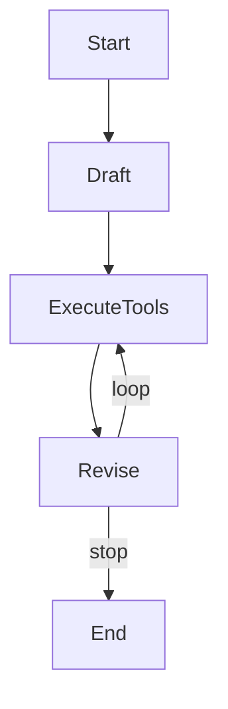

prompt: 下面是字幕，如何建立agent。根据字幕，给我步骤。 我会一直提供字幕，直到我通知你生成答案。不要给我生成答案，在我通知你之前。
prompt: 根据我提供的所有字幕，系统地总结出 **从零构建 Reflexion Agent 的完整步骤**，分为阶段、子任务与关键实现细节。

Section 14: Reflection Agent
非常好，这段字幕是讲 **如何用 LangGraph 建立一个完整的 AI Agent（基于 Flow Engineering 思想）**。
下面我将把整段内容拆解成 **逐步构建流程**，并解释每一步的 **目的、关键点、和代码逻辑**。

---

## 🧭 一、总体目标

要构建一个具备「**生成（Generate）→ 反思（Reflect）→ 再生成**」循环逻辑的 Agent。

LangGraph 用「**节点（Nodes）+ 边（Edges）+ 状态（State）**」描述整个流程。
目标是构建一个工作流（Workflow），让 LLM 在既定流程中循环生成与改进输出。

---

## 🧩 二、构建步骤总览（宏观流程）

| 阶段     | 主要工作                     | 结果             |
| ------ | ------------------------ | -------------- |
| Step 1 | 定义 Chains（生成链、反思链）       | Agent 的基本逻辑块   |
| Step 2 | 定义 Nodes（节点）             | 每个节点执行一个 chain |
| Step 3 | 定义 State（状态结构）           | 保存上下文消息历史      |
| Step 4 | 构建 Graph（图结构）            | 把节点、边、条件逻辑连起来  |
| Step 5 | 定义条件函数 `should_continue` | 决定继续循环还是结束     |
| Step 6 | 编译、绘制并测试 Graph           | 输出可视化并验证流程     |

---

## 🧱 Step 1：定义 Chains（已在前一节完成）

* **Generate Chain**：生成推文（AI 输出）
* **Reflect Chain**：对生成结果进行反思、批评
* 每个 Chain 之后都会返回一个 **消息对象（BaseMessage / AIMessage）**

---

## 🧠 Step 2：定义 Nodes（节点）

每个节点对应一个 chain：

| 节点           | 调用的 Chain        | 输入                    | 输出                | 功能     |
| ------------ | ---------------- | --------------------- | ----------------- | ------ |
| **generate** | `generate_chain` | 当前状态（message history） | AI 生成的新消息         | 执行生成逻辑 |
| **reflect**  | `reflect_chain`  | 当前状态                  | 人类消息（模拟 critique） | 执行反思逻辑 |

> 生成节点的输出是 `AIMessage`，反思节点的输出是 `HumanMessage`（这是一个 prompt engineering 技巧，让模型认为批评来自人类，从而提升响应质量）。

---

## 📦 Step 3：定义 State（状态结构）

状态用于保存所有消息的上下文。
使用 `TypedDict` 声明结构化数据：

```python
class MessageGraph(TypedDict):
    messages: Annotated[List[BaseMessage], add_messages]
```

* `messages`：保存所有的历史消息（人类与 AI）；
* `add_messages`：一个 **reducer 函数**，定义如何更新状态；

  * 每次节点执行后新消息会被「append」到历史列表，而不是覆盖；
  * 这保证了对话上下文持续积累。

---

## 🧩 Step 4：创建 Graph 并添加 Nodes

创建一个 `StateGraph` 对象：

```python
workflow = StateGraph(state_schema=MessageGraph)
```

添加节点：

```python
workflow.add_node("generate", generation_node)
workflow.add_node("reflect", reflection_node)
```

设置 **入口节点（entry point）**：

```python
workflow.set_entry_point("generate")
```

> 这会在内置的 `Start` 节点与 `generate` 节点之间自动创建一条初始边。

---

## 🔀 Step 5：定义 Edges（边与条件逻辑）

### (1) 固定边（Deterministic Edge）

* `reflect → generate`：每次反思后必定进入新的生成。

### (2) 条件边（Conditional Edge）

* `generate → reflect` 或 `generate → end`：由条件函数 `should_continue` 决定。

```python
def should_continue(state: MessageGraph) -> str:
    if len(state["messages"]) >= 6:
        return "end"
    else:
        return "reflect"
```

然后在图中添加这条条件边：

```python
workflow.add_conditional_edges(
    "generate",                     # 来源节点
    should_continue,                # 条件函数
    path_map={"reflect": "reflect", "end": END}  # 目标映射
)
```

---

## 🪄 Step 6：编译与可视化

```python
graph = workflow.compile()
```

可使用以下方式导出可视化结构：

* Mermaid 图（适合导入 Excalidraw 或 Markdown）：

  ```python
  print(graph.get_graph().draw_mermaid())
  ```
* ASCII 图（命令行查看）：

  ```python
  graph.get_graph().print_ascii()
  ```

Mermaid 图例：

```
Start --> Generate
Generate --> Reflect
Reflect --> Generate
Generate --> End
```

---

## 🔁 Step 7：运行时执行逻辑

执行顺序如下：

1. **Generate Node** → 运行 `generate_chain`
2. 调用 `should_continue` 判断：

   * 若条件满足 → 跳至 **Reflect Node**
   * 若结束 → 跳至 **End Node**
3. **Reflect Node** → 运行 `reflect_chain`
4. 更新状态 → 再次回到 Generate Node
5. 重复循环直到 `should_continue` 返回 "end"

---

## ⚙️ Step 8：运行后的结果

运行时：

* 所有消息依次追加到 `state["messages"]`
* 模型每次调用都能看到完整历史上下文
* 可在 trace 中观察每次生成与反思的演进

---

## 💡 关键总结

| 模块                | 核心作用      | LangGraph 对应                             |
| ----------------- | --------- | ---------------------------------------- |
| **State**         | 保存所有上下文   | `TypedDict` + Reducer                    |
| **Node**          | 执行具体逻辑    | Chain 调用函数                               |
| **Edge**          | 定义执行路径    | `add_edge()` / `add_conditional_edges()` |
| **Reducer**       | 定义状态更新方式  | `add_messages`                           |
| **Flow Control**  | 控制何时继续/结束 | `should_continue()`                      |
| **Visualization** | 输出流程图     | `draw_mermaid()` / `print_ascii()`       |

---
# Section 15 Reflexion Agent

非常好！你已经完整提供了建立 **Reflexion Agent（反思型智能体）** 的全部教学字幕内容。
下面我将根据你提供的所有字幕，系统地总结出 **从零构建 Reflexion Agent 的完整步骤**，分为阶段、子任务与关键实现细节。
（这对应 LangGraph + LangChain 实现的「具备自我反思、搜索与修订能力」的 Agent 架构）

---

# 🧭 一、总体目标

构建一个具备以下特性的 **Reflection Agent**：

* 能生成高质量的文章回答；
* 会对自己的输出进行批评（critique）；
* 可使用搜索工具实时查找外部信息；
* 在多轮循环中修订答案、添加引用；
* 最终输出包含内容、批评、引用的结构化结果。

---

# 🧩 二、系统组件结构概览

| 模块                                      | 主要功能                                        |
| --------------------------------------- | ------------------------------------------- |
| **First Responder Chain (Actor Agent)** | 生成初稿 + 批评 + 搜索建议                            |
| **Tool Executor Node**                  | 根据搜索建议调用 Tavily API 获取实时数据                  |
| **Reviser Chain (Reviser Agent)**       | 使用搜索结果与批评修订文章并添加引用                          |
| **State (MessageGraph)**                | 储存所有消息与执行上下文                                |
| **Graph (LangGraph)**                   | 定义节点连接与循环逻辑（Draft → Search → Revise → Loop） |

---

# 🧱 三、详细构建步骤

## Step 1️⃣ 设计总体架构

1. 定义 3 个节点：

   * **Draft Node** → 生成初稿；
   * **Execute Tools Node** → 调用 Tavily 搜索；
   * **Revise Node** → 使用搜索结果修订答案。
2. 设置执行顺序：

   ```
   Start → Draft → Execute Tools → Revise → (loop or end)
   ```
3. 使用 **LangGraph** 构建有状态的 Graph。

---

## Step 2️⃣ 构建 State（消息状态）

```python
from typing import List
from langchain.schema import BaseMessage
from langgraph.graph import add_messages
from typing_extensions import TypedDict, Annotated

class MessageGraph(TypedDict):
    messages: Annotated[List[BaseMessage], add_messages]
```

* `messages` 保存所有人类、AI 与工具调用消息；
* `add_messages` 是 reducer，确保状态更新为“追加”，而非覆盖。

---

## Step 3️⃣ 构建 Actor Agent（First Responder Chain）

### ✳️ 功能

根据主题生成：

* 初稿（article content）
* 批评（critique）
* 搜索建议（search queries）

### ✳️ 关键步骤

1. **导入模块**（包括 `ChatOpenAI`, `ChatPromptTemplate`, `Pydantic` 等）；
2. **创建 Prompt 模板**：

```python
actor_prompt_template = ChatPromptTemplate.from_messages([
    ("system", 
     "You are an expert researcher. Current time: {time}. "
     "1️⃣ Write a 250-word article.\n"
     "2️⃣ Reflect and critique your answer (be severe).\n"
     "3️⃣ Recommend search queries to improve your answer.")
])
```

3. **定义输出 Schema（schemas.py）**：

```python
from pydantic import BaseModel, Field
from typing import List

class Reflection(BaseModel):
    missing: str = Field(..., description="Important info missing")
    superfluous: str = Field(..., description="Unnecessary info")

class AnswerQuestion(BaseModel):
    answer: str = Field(..., description="250-word essay")
    reflection: Reflection
    search_queries: List[str] = Field(..., description="1–3 search terms")
```

4. **创建 LLM 与解析器**：

   * 使用 `GPT-4 Turbo`
   * 使用 `PydanticToolsOutputParser` 和 `JSONOutputToolsParser`
   * 通过 function calling 绑定输出结构：

```python
chain = (
    actor_prompt_template
    | llm.bind_tools(tools=[AnswerQuestion], tool_choice="AnswerQuestion")
    | PydanticToolsOutputParser(pydantic_object=AnswerQuestion)
)
```

5. **运行测试**：

   * 输入一个主题（例如 `"AI-powered SOC startups"`）
   * 输出结构中包含 `answer`, `reflection`, `search_queries`

---

## Step 4️⃣ 构建 Reviser Agent（Revision Chain）

### ✳️ 功能

利用前一步生成的批评与搜索结果，修订文章，添加引用。

### ✳️ 步骤

1. **在 `schemas.py` 新增类**：

```python
class ReviseAnswer(AnswerQuestion):
    references: List[str] = Field(..., description="URLs for citations")
```

2. **定义新的指令模板**：

```python
revise_instructions = """
Revise your previous answer using the critique and new info.
- Add missing info and remove superfluous details.
- Add numerical citations.
- Include a References section (URLs).
"""
```

3. **复用 actor prompt**：
   在 `First Instruction` 占位符中插入 `revise_instructions`。

4. **创建 Reviser Chain**：

```python
reviser_chain = (
    actor_prompt_template.partial(first_instruction=revise_instructions)
    | llm.bind_tools(tools=[ReviseAnswer], tool_choice="ReviseAnswer")
    | PydanticToolsOutputParser(pydantic_object=ReviseAnswer)
)
```

---

## Step 5️⃣ 构建 Tool Executor Node

### ✳️ 功能

读取前一步中生成的搜索查询并使用 Tavily 搜索实时数据。

### ✳️ 步骤

1. **导入 Tavily 工具**：

```python
from langchain_tavily import TavilySearch
from langchain.tools import StructuredTool
from langgraph.prebuilt import ToolNode
```

2. **定义执行函数**：

```python
def run_queries(search_queries: List[str], **kwargs):
    results = TavilySearch(max_results=5).batch(search_queries)
    return results
```

3. **创建两个工具实例**（便于追踪不同阶段）：

```python
tool_1 = StructuredTool.from_function(run_queries, name="AnswerQuestion")
tool_2 = StructuredTool.from_function(run_queries, name="ReviseAnswer")
```

4. **注册为 Graph 节点**：

```python
execute_tools_node = ToolNode(tools=[tool_1, tool_2])
```

---

## Step 6️⃣ 组装完整 Graph

```python
from langgraph.graph import StateGraph, END

builder = StateGraph(state_schema=MessageGraph)

# === 添加节点 ===
builder.add_node("draft", first_responder_chain)
builder.add_node("execute_tools", execute_tools_node)
builder.add_node("revise", reviser_chain)

# === 建立边关系 ===
builder.add_edge("draft", "execute_tools")
builder.add_edge("execute_tools", "revise")

# === 定义条件函数（控制循环）===
MAX_ITER = 2

def event_loop(state) -> str:
    tool_msgs = sum(isinstance(m, ToolMessage) for m in state["messages"])
    return "end" if tool_msgs >= MAX_ITER else "execute_tools"

builder.add_conditional_edges("revise", event_loop, path_map={"execute_tools":"execute_tools", "end":END})
builder.set_entry_point("draft")
graph = builder.compile()
```

---

## Step 7️⃣ 可视化 Graph

```python
graph.get_graph().draw_mermaid_png("reflection_agent.png")
```

输出结构大致如下：



---

## Step 8️⃣ 运行并追踪结果

```python
result = graph.invoke({"messages": ["Write about AI-powered SOC startups."]})
```

* 查看最终输出中的：

  * `answer`: 修订后的高质量文章；
  * `reflection`: 对应改进建议；
  * `references`: 搜索到的引用；
* 使用 **LangSmith / Tracing UI** 查看执行链与节点状态。

---

# 🧠 九、流程总结

| 阶段       | 组件                    | 说明                               |
| -------- | --------------------- | -------------------------------- |
| 1️⃣ 生成初稿 | First Responder Chain | 输出初稿 + critique + search queries |
| 2️⃣ 调用工具 | Tool Executor Node    | 执行搜索并返回结果                        |
| 3️⃣ 修订文章 | Reviser Chain         | 根据 critique + search 结果修订文章      |
| 4️⃣ 循环控制 | event_loop()          | 控制执行次数（或条件终止）                    |
| 5️⃣ 状态维护 | MessageGraph          | 储存所有交互消息                         |

---

# 🏁 十、最终产物

✅ 一个完整的 **Reflection Agent Graph**，具备以下能力：

* 动态生成并批评内容；
* 自动调用实时搜索；
* 根据反馈持续改进；
* 输出带引用的高质量文章；
* 结构完全可追踪，可视化。

---
# Section 16: Agentic RAG

下面是根据你提供的全部字幕，系统性总结的 **从零构建 Agentic RAG（Reflection-Based Adaptive RAG）系统的完整阶段化指南**。
它不仅复现了视频的实现逻辑，也抽象出软件工程层面的结构设计思路。

---

## 🧭 第一阶段：项目初始化与工程环境

### 🎯 目标

为构建可扩展、可测试的 **LangGraph-Agent 项目** 建立环境与目录结构。

### 🧱 子任务与实现细节

| 子任务    | 实现要点                                                                                                                                                                              |
| ------ | --------------------------------------------------------------------------------------------------------------------------------------------------------------------------------- |
| 创建项目   | `mkdir langgraph_agent && cd langgraph_agent`                                                                                                                                     |
| 初始化依赖  | 使用 `poetry init`；依次安装：`langchain`, `langgraph`, `langchainhub`, `langchain-community`, `chromadb`, `beautifulsoup4`, `python-dotenv`, `pytest`, `black`, `isort`, `tavily-python` |
| 环境变量   | 创建 `.env` 文件，保存 `OPENAI_API_KEY`, `TAVILY_API_KEY`, `LANGCHAIN_PROJECT` 等                                                                                                         |
| IDE 配置 | PyCharm 绑定 poetry 环境；设置 pytest 运行器                                                                                                                                                |
| 项目结构   | 采用包化结构映射系统架构：                                                                                                                                                                     |

```
graph/ (核心执行层)
chains/ (功能链)
nodes/ (执行节点)
tests/ (单测)
ingestion.py (文档导入)
main.py (入口)
```

---

## 🧩 第二阶段：数据层与索引层

### 🎯 目标

实现 **文档加载 + 向量化 + 向量数据库构建**。

### 🧱 子任务

1. **加载数据**

   * 使用 `WebBaseLoader` 从 URL 抓取多篇生成式 AI、Prompt Engineering、LLM 安全相关文章。
2. **文本切块**

   * `RecursiveCharacterTextSplitter.from_tiktoken_encoder(chunk_size=250, chunk_overlap=0)`
3. **嵌入与存储**

   * `OpenAIEmbeddings()` → 向量化
   * `Chroma.from_documents(docs, persist_directory="./.chroma")`
4. **检索器**

   * `retriever = Chroma(persist_directory=...).as_retriever()`

> ✅ 输出：`retriever` 供后续节点使用。

---

## 🧠 第三阶段：图状态建模（Graph State）

### 🎯 目标

定义跨节点共享状态的类型系统。

```python
class GraphState(TypedDict):
    question: str
    documents: list[str]
    web_search: bool
    generation: str
```

---

## ⚙️ 第四阶段：节点（Node）实现

| 节点                  | 功能     | 输入 / 输出                        | 核心逻辑                                                         |
| ------------------- | ------ | ------------------------------ | ------------------------------------------------------------ |
| `retrieve`          | 向量搜索   | 输入 `question` → 输出 `documents` | 调用 retriever.invoke(question)                                |
| `grade_documents`   | 文档打分过滤 | 输入 `(question, docs)`          | 调用 Retrieval Grader Chain 过滤不相关文档；若发现不相关 → `web_search=True` |
| `web_search`        | 网络检索   | 输入 `(question)`                | 调用 Tavily 搜索，合并内容为单个 LangDoc                                 |
| `generate`          | 回答生成   | 输入 `(question, docs)`          | 使用标准 React Prompt 生成回答                                       |
| *(可选)* `regenerate` | 重新生成   | 输入 `(question, docs)`          | 同 `generate`                                                 |

> 所有节点遵循签名：`def node(state: GraphState) -> dict:`

---

## 🔗 第五阶段：功能链（Chain）实现

| Chain                    | 功能                                | 核心技术点                                              |
| ------------------------ | --------------------------------- | -------------------------------------------------- |
| **Retrieval Grader**     | 判断文档与问题是否相关                       | LLM + `with_structured_output(PydanticModel)`      |
| **Generation Chain**     | 标准 RAG prompt 生成答案                | 从 LangChain Hub 加载 `"rlm/rag-prompt"`              |
| **Hallucination Grader** | 判断生成答案是否 grounded in documents    | Prompt: “Is the answer supported by facts?”        |
| **Answer Grader**        | 判断答案是否回答了原问题                      | Prompt: “Does the answer resolve the question?”    |
| **Router Chain**         | 判断问题路由到 Vector Store 或 Web Search | Structured output 返回 `vector_store` / `web_search` |

> ✅ 所有 Grader Chain 均基于 Pydantic structured output 与 ChatOpenAI（支持 function calling）。

---

## 🧮 第六阶段：图（Graph）编排与条件流转

### 🧱 子任务一：定义常量

```python
RETRIEVE = "retrieve"
GRADE_DOCS = "grade_documents"
WEB_SEARCH = "web_search"
GENERATE = "generate"
END = "end"
```

---

### 🧱 子任务二：条件函数设计

| 函数名                                                | 触发时机     | 逻辑                                                                                   |
| -------------------------------------------------- | -------- | ------------------------------------------------------------------------------------ |
| `decide_to_generate()`                             | 文档评分后    | 若 `web_search=True` → 进入 Web Search，否则 → Generate                                    |
| `grade_generation_grounded_in_docs_and_question()` | 生成后      | 结合 Hallucination Grader + Answer Grader 决定：`useful` / `not_useful` / `not_supported` |
| `route_question()`                                 | Graph 起点 | 调用 Router Chain → 决定走 Vector Store 流或 Web Search 流                                   |

---

### 🧱 子任务三：连接节点（Graph 架构）

```python
workflow = StateGraph(GraphState)
workflow.add_node(RETRIEVE, retrieve)
workflow.add_node(GRADE_DOCS, grade_documents)
workflow.add_node(WEB_SEARCH, web_search)
workflow.add_node(GENERATE, generate)
```

**条件入口 (Adaptive RAG)：**

```python
workflow.set_conditional_entry_point(route_question, {
    WEB_SEARCH: WEB_SEARCH,
    RETRIEVE: RETRIEVE
})
```

**文档评分分支：**

```python
workflow.add_edge(RETRIEVE, GRADE_DOCS)
workflow.add_conditional_edges(GRADE_DOCS, decide_to_generate, {
    WEB_SEARCH: WEB_SEARCH,
    GENERATE: GENERATE
})
```

**Self-RAG 反思分支：**

```python
workflow.add_conditional_edges(GENERATE, grade_generation_grounded_in_docs_and_question, {
    "useful": END,
    "not_useful": WEB_SEARCH,
    "not_supported": GENERATE
})
```

**辅助边：**

```python
workflow.add_edge(WEB_SEARCH, GENERATE)
workflow.add_edge(GENERATE, END)
workflow.compile()
```

> ✅ Graph 自动绘制为 `graph.png`，节点流清晰可视化。

---

## 🧪 第七阶段：测试与验证

* **单元测试**

  * 各 Chain 测试通过 structured output 验证正确性；
  * 典型测试：

    * `Retrieval Grader`：Yes / No
    * `Hallucination Grader`：Grounded / Not Grounded
    * `Router`：Vector Store / Web Search
* **端到端测试**

  * `pytest -v`
  * `LangSmith` 跟踪执行流，验证 conditional edges 路径是否符合预期。

---

## 🧭 第八阶段：主程序运行（main.py）

```python
from graph.graph import workflow

if __name__ == "__main__":
    question = "What is agent memory?"
    inputs = {"question": question, "documents": [], "web_search": False, "generation": ""}
    result = workflow.invoke(inputs)
    print(result["generation"])
```

### 💡 两个验证示例：

| 输入问题                    | 预期路径                                                                  |
| ----------------------- | --------------------------------------------------------------------- |
| “What is agent memory?” | Route → VectorStore → Retrieve → GradeDocs → Generate → Reflect → END |
| “How to make pizza?”    | Route → WebSearch → Generate → Reflect → END                          |

---

## 🤖 第九阶段（可选）：封装为 Agent

如果希望以通用 Agent 调用方式集成：

```python
from langgraph.prebuilt import create_agent

agentic_rag = create_agent(
    graph=workflow,
    description="Adaptive Reflection RAG Agent",
    inputs=["question"],
    outputs=["generation"]
)

agentic_rag.invoke({"question": "Explain agent memory"})
```

> ✅ 这样系统即可像一个智能 Agent 自动执行完整 RAG 流。

---

## 🧱 第十阶段：总结与扩展方向

| 维度             | 关键要点                                              |
| -------------- | ------------------------------------------------- |
| **架构模式**       | Graph = 有状态可控执行流，支持条件边（if-else）与动态入口（router）      |
| **Agentic 特性** | 自反思（Self-RAG）、纠错（Corrective-RAG）、路由（Adaptive-RAG） |
| **工程实践**       | 模块化、可测试、可追踪（LangSmith Trace）                      |
| **扩展方向**       | 多知识库路由、异步搜索、反馈记忆（Memory Node）、多模型协同（ReAct Agent）  |

---

✅ **最终成果：**

> 一个完整的、可在生产环境部署的
> **Agentic Reflection-RAG 系统**
> ——具备自我反思、自适应路由、质量校验与多源信息融合能力。


